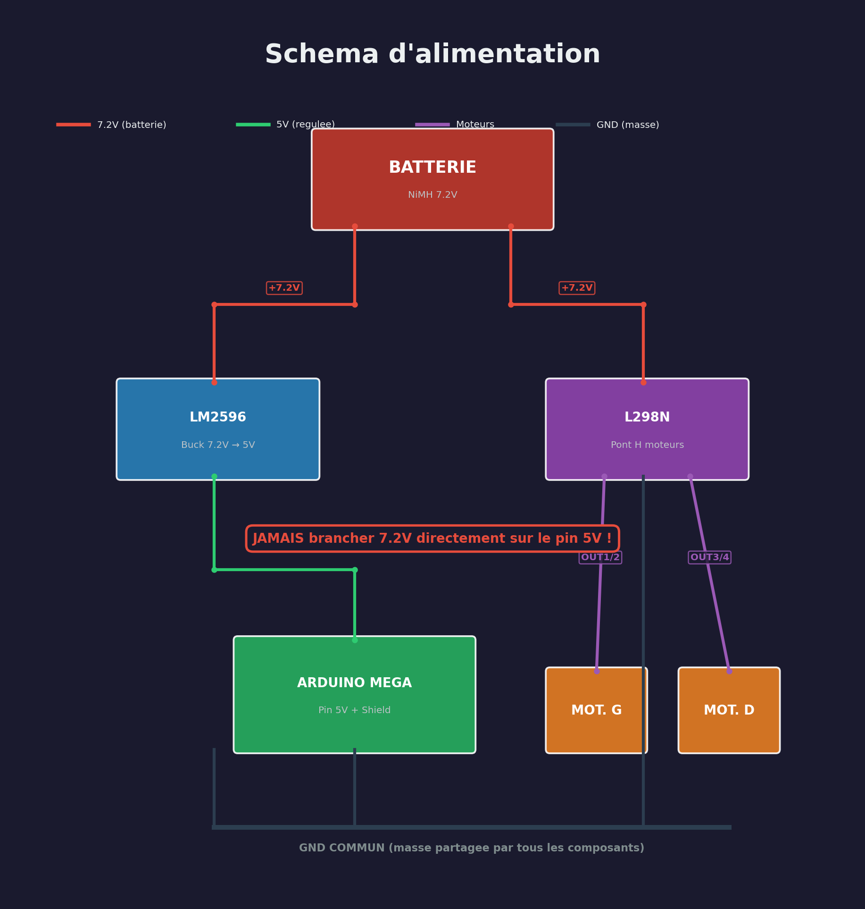
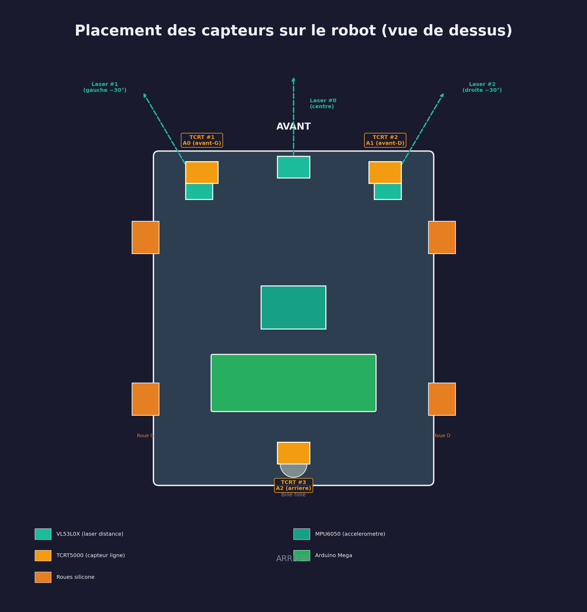
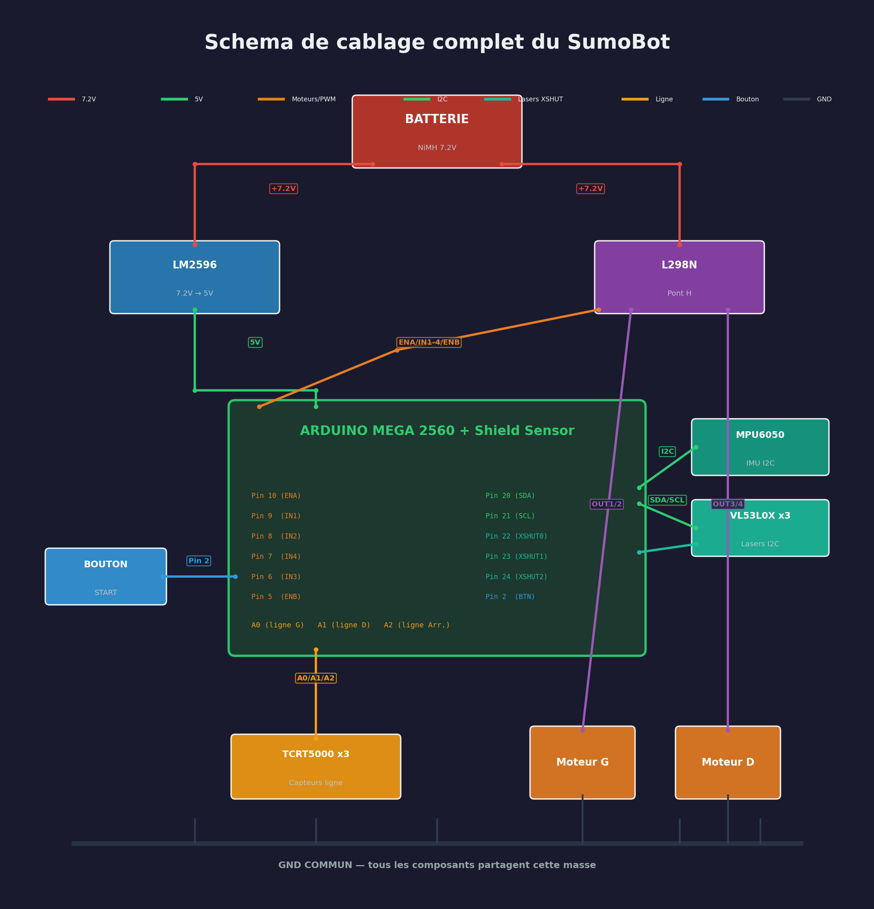
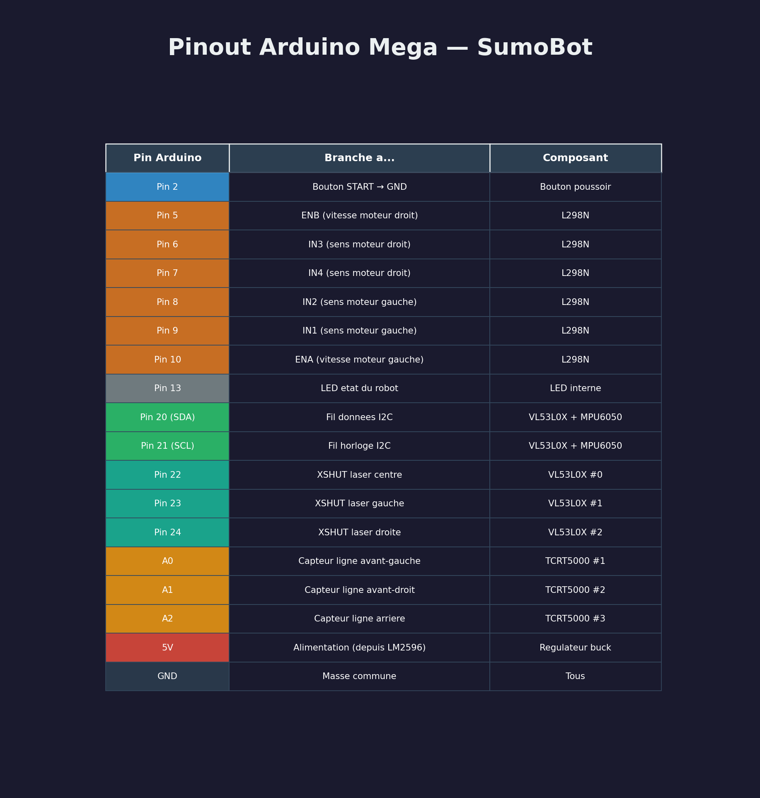

# Guide de montage du robot

Ce guide explique comment assembler le robot sumo pas a pas. Chaque etape est testable individuellement : on branche, on teste, et on passe a la suite seulement quand ca marche.

## De quoi a-t-on besoin ?

### Les composants principaux

| Piece | C'est quoi ? | Combien ? |
| ----- | ------------ | --------- |
| Arduino Mega 2560 | Le "cerveau" du robot. C'est un mini-ordinateur qu'on peut programmer | 1 |
| Sensor Shield Mega | Une carte qui se branche sur l'Arduino pour faciliter le branchement des capteurs | 1 |
| L298N | Un module qui permet a l'Arduino de controler les moteurs (l'Arduino seule n'est pas assez puissante) | 1 |
| Moteurs N20 12V 500RPM | Petits moteurs avec reducteur, ils font tourner les roues | 2 |
| Roues silicone | Roues en silicone qui accrochent bien sur le ring | 2 |
| Bille folle | Une petite roulette qui sert de 3eme point d'appui a l'arriere | 1 |
| VL53L0X | Capteurs laser qui mesurent la distance (pour "voir" l'adversaire) | 3 |
| TCRT5000 | Capteurs infrarouge qui detectent la couleur du sol (noir = ring, blanc = bord) | 3 |
| MPU6050 | Capteur qui detecte les mouvements, chocs et rotations du robot | 1 |
| Batterie NiMH 7.2V | La batterie rechargeable qui alimente tout | 1 |
| Module LM2596 | Un convertisseur qui transforme le 7.2V de la batterie en 5V pour l'Arduino | 1 |
| Bouton poussoir | Pour demarrer le match | 1 |
| Fils Dupont et connecteurs | Pour relier tous les composants entre eux | - |

### Les outils necessaires

- Un tournevis cruciforme (petit)
- Un multimetre (pour verifier les tensions)
- Arduino IDE installe sur un ordinateur (logiciel gratuit)
- Un cable USB pour brancher l'Arduino a l'ordinateur

## Vocabulaire utile

Avant de commencer, voici quelques mots qu'on va utiliser souvent :

| Mot | Signification |
| --- | ------------- |
| **GND** | La masse, c'est le "-" de l'alimentation. Comme le pole negatif d'une pile |
| **VCC** ou **5V** | L'alimentation positive a 5 volts |
| **Pin** | Une broche (patte metallique) sur l'Arduino ou un composant |
| **PWM** | Un signal qui permet de controler la vitesse d'un moteur (au lieu de juste "allume/eteint") |
| **I2C** | Un "langage" que les capteurs utilisent pour parler a l'Arduino a travers 2 fils (SDA et SCL) |
| **Shield** | Une carte qui s'empile sur l'Arduino pour ajouter des fonctions |
| **Serial Monitor** | Un ecran dans Arduino IDE qui affiche les messages du robot (utile pour le debug) |

## Etape 1 — L'alimentation (le courant electrique)

C'est la premiere chose a faire : s'assurer que tout est bien alimente.

### Le probleme

La batterie donne 7.2V, mais l'Arduino et les capteurs ont besoin de 5V. Si on branche 7.2V directement, on grille tout ! Il faut donc un convertisseur (le module LM2596) qui transforme le 7.2V en 5V.

### Branchement de l'alimentation



### Comment regler le LM2596

1. Brancher la batterie sur les bornes Vin (+) et Vin (-) du LM2596
2. **Ne rien brancher sur la sortie pour l'instant**
3. Mettre le multimetre sur la sortie (Vout + et Vout -)
4. Tourner la petite vis (potentiometre) avec un tournevis jusqu'a lire **5.0V**
5. Seulement maintenant, brancher la sortie sur le pin 5V de l'Arduino

> **ATTENTION** : Ne JAMAIS brancher la batterie 7.2V directement sur le pin 5V de l'Arduino. Ca le detruit immediatement et c'est irreversible.

### Verification

Brancher la batterie. L'Arduino doit s'allumer (une petite LED verte s'allume sur la carte). Si rien ne se passe, verifier les branchements et la tension du LM2596.

## Etape 2 — Les moteurs

Les moteurs font avancer et tourner le robot. On en utilise 2 : un a gauche et un a droite. En les faisant tourner a des vitesses differentes, le robot peut tourner.

### Le role du L298N

L'Arduino ne peut pas alimenter les moteurs directement (pas assez de puissance). Le module L298N sert d'intermediaire : l'Arduino lui envoie des ordres ("tourne a gauche, vitesse 50%"), et le L298N transmet la puissance de la batterie aux moteurs.

### Branchement des moteurs

```text
L298N                    Arduino Mega
─────                    ────────────
ENA ──────────────────── Pin 10     (vitesse moteur gauche)
IN1 ──────────────────── Pin 9      (sens moteur gauche)
IN2 ──────────────────── Pin 8      (sens moteur gauche)
IN3 ──────────────────── Pin 6      (sens moteur droit)
IN4 ──────────────────── Pin 7      (sens moteur droit)
ENB ──────────────────── Pin 5      (vitesse moteur droit)
GND ──────────────────── GND

L298N                    Moteurs
─────                    ───────
OUT1, OUT2 ──────────── Moteur GAUCHE (les 2 fils du moteur)
OUT3, OUT4 ──────────── Moteur DROIT  (les 2 fils du moteur)
```

### Le jumper 5V du L298N

Il y a un petit cavalier (jumper) sur le L298N marque "5V EN". **Il faut l'enlever.** Ce jumper active un regulateur interne qui n'est pas assez puissant pour notre robot. On utilise le LM2596 a la place.

### Si un moteur tourne a l'envers

Pas de panique ! Il suffit d'inverser les 2 fils du moteur sur le bornier du L298N (echanger OUT1 et OUT2, ou OUT3 et OUT4).

### Test

1. Brancher l'Arduino a l'ordinateur en USB
2. Ouvrir `test_moteur1/test_moteur1.ino` dans Arduino IDE
3. Cliquer sur "Upload" (fleche vers la droite)
4. Le moteur gauche doit tourner dans un sens, puis dans l'autre
5. Ensuite, tester avec `test_2moteurs/test_2moteurs.ino` : les deux moteurs tournent ensemble (avant, arriere, tourne a gauche, tourne a droite)

## Etape 3 — Les capteurs de ligne (TCRT5000)

Ces capteurs empechent le robot de tomber du ring. Ils envoient un faisceau infrarouge vers le sol et mesurent la lumiere reflechie. Le sol noir du ring reflechit peu, mais la bordure blanche reflechit beaucoup.

### Branchement des capteurs de ligne

On utilise le Shield Sensor, une carte qui se branche directement sur l'Arduino et qui offre des rangees de 3 broches (S, V, G) pour chaque pin :

- **S** = Signal (le fil de donnees du capteur)
- **V** = 5V (l'alimentation du capteur)
- **G** = GND (la masse)

```text
Shield Sensor Mega (section ANALOG)
────────────────────────────────────
Pin A0 (S/V/G) ──── TCRT5000 #1 (avant-gauche)
Pin A1 (S/V/G) ──── TCRT5000 #2 (avant-droit)
Pin A2 (S/V/G) ──── TCRT5000 #3 (arriere)
```

> **ATTENTION** : Le shield a deux zones qui se ressemblent. Les pins analogiques (A0, A1, A2...) sont d'un cote, et les pins numeriques de l'autre. Il faut brancher sur le cote **ANALOG**.

### Ou placer les capteurs sur le robot

Le placement de tous les capteurs est visible sur ce schema (vue de dessus) :



Les 2 capteurs avant depassent du chassis vers l'avant, a 5mm du sol. Le capteur arriere est au milieu, a 5mm du sol aussi.

### Test et calibration

1. Ouvrir `test_capteur_ligne/test_capteur_ligne.ino` et l'envoyer sur l'Arduino
2. Ouvrir le Serial Monitor dans Arduino IDE (icone loupe en haut a droite, regler sur 9600 baud)
3. Presenter une feuille blanche sous le capteur : on doit voir une valeur basse (ex: 100-200)
4. Presenter une surface noire : la valeur doit etre haute (ex: 600-900)
5. Le seuil par defaut est 300. Si vos valeurs sont differentes, ajustez-le dans le code

Ensuite, tester avec `test_ligne_moteurs/test_ligne_moteurs.ino` : le robot doit avancer et reculer automatiquement quand il detecte du blanc.

## Etape 4 — Les capteurs de distance (VL53L0X)

Ce sont les "yeux" du robot. Ils envoient un faisceau laser invisible et mesurent le temps que met la lumiere a revenir, ce qui donne la distance d'un objet (ici, l'adversaire). Portee : environ 80 cm.

Le robot en utilise 3 : un qui regarde droit devant, et deux sur les cotes (a environ 30 degres). Ca lui donne un "champ de vision" de 60 degres.

### Le probleme : ils ont tous la meme adresse

Les VL53L0X communiquent avec l'Arduino par un systeme appele I2C (2 fils partages : SDA et SCL). Le probleme, c'est qu'ils ont tous la meme "adresse" par defaut. C'est comme si 3 eleves dans une classe avaient le meme prenom : quand le prof appelle, ils repondent tous en meme temps !

La solution : chaque capteur a un fil special (XSHUT) qui permet de l'allumer ou l'eteindre. Au demarrage, le code allume les capteurs un par un et donne a chacun une adresse differente.

### Branchement des lasers

```text
Les 3 VL53L0X partagent les memes fils I2C :
  VIN ──── 5V (via le shield)
  GND ──── GND
  SDA ──── Pin 20 (sur l'Arduino Mega, c'est le fil de donnees I2C)
  SCL ──── Pin 21 (c'est le fil d'horloge I2C)

Chaque capteur a son fil XSHUT individuel :
  VL53L0X #0 (centre) : XSHUT ──── Pin 22
  VL53L0X #1 (gauche) : XSHUT ──── Pin 23
  VL53L0X #2 (droite) : XSHUT ──── Pin 24
```

### Ou placer les capteurs laser

Le placement des lasers est visible sur le schema des capteurs plus haut. Le laser #0 pointe droit devant, les lasers #1 et #2 sont orientes a environ 30 degres de chaque cote.

> **Pourquoi 30 degres et pas plus ?** On a teste avec des angles de 60 et 90 degres dans le simulateur, mais le robot perdait la cible trop souvent. A 30 degres, il gagne 8% de matchs en plus !

### Test

Apres le branchement, envoyer le code principal (`sumo_strategy/sumo_strategy.ino`) et ouvrir le Serial Monitor. Au demarrage, le message "Lasers OK" doit apparaitre. Si vous voyez "ERR laser0" (ou 1 ou 2), verifier le cablage du capteur concerne.

## Etape 5 — L'accelerometre/gyroscope (MPU6050)

Ce capteur detecte les mouvements du robot : les chocs, les rotations, et meme si le robot est souleve par l'adversaire. C'est un peu comme l'oreille interne chez l'humain, qui nous donne le sens de l'equilibre.

### Branchement de l'IMU

Le MPU6050 partage les memes fils I2C que les capteurs laser (SDA et SCL), mais avec une adresse differente, donc pas de conflit.

```text
MPU6050              Arduino Mega
───────              ────────────
VCC ──────────────── 5V (via le shield)
GND ──────────────── GND
SDA ──────────────── Pin 20 (meme fil que les VL53L0X)
SCL ──────────────── Pin 21 (meme fil que les VL53L0X)
AD0 ──────────────── GND (ca fixe son adresse pour eviter les conflits)
```

### Ce que le robot en fait

| Mesure | Le robot l'utilise pour... |
| ------ | ------------------------- |
| Acceleration avant/arriere | Detecter une collision frontale et esquiver sur le cote |
| Acceleration laterale | Detecter un choc sur le cote et tourner vers l'attaquant |
| Vitesse de rotation | Savoir quand il a fait un tour complet en mode recherche |

### Placement de l'IMU

Monter le MPU6050 **au centre du robot**, bien fixe. S'il vibre trop, les mesures seront fausses. Utiliser du scotch double-face epais ou de la mousse pour l'isoler des vibrations.

## Etape 6 — Le bouton de demarrage

En competition, on doit appuyer sur un bouton, puis le robot attend 5 secondes avant de commencer (c'est la regle). Ce bouton declenche le compte a rebours.

### Branchement du bouton

C'est le branchement le plus simple du projet :

```text
Bouton poussoir
  Broche 1 ──── Pin 2 de l'Arduino
  Broche 2 ──── GND
```

Pas besoin de resistance : l'Arduino a une resistance interne (pull-up) qui fait le travail.

### Comment ca marche

1. Robot allume → la LED de l'Arduino clignote **lentement** (il attend)
2. Appui sur le bouton → la LED clignote **vite** (compte a rebours de 5 secondes)
3. Fin du compte a rebours → le robot demarre et cherche l'ennemi

## Schema de cablage complet

Voici une vue d'ensemble de tous les branchements :



## Tableau recapitulatif : quel fil va ou



## Conseils importants

### La masse commune (GND)

C'est la cause numero 1 des problemes. **Tous les composants doivent partager le meme GND.** Si un seul GND est mal branche, les moteurs peuvent se comporter bizarrement, les capteurs peuvent donner des valeurs fausses, etc. En cas de probleme, verifier les GND en premier.

### Le poids

En competition, le robot doit peser moins de 1 kg. Voici une estimation du poids de chaque piece :

| Piece | Poids |
| ----- | ----- |
| Arduino Mega + shield | ~55g |
| L298N | ~30g |
| 2 moteurs N20 + roues | ~40g |
| Batterie NiMH 7.2V | ~150-200g |
| Chassis + lame | ~300-400g |
| Capteurs + cablage | ~50g |
| **Total** | **~625-775g** |

Il reste de la marge, mais attention au chassis : c'est souvent la piece la plus lourde.

### Les vibrations

Les capteurs laser (VL53L0X) et l'accelerometre (MPU6050) sont sensibles aux vibrations. Si le robot vibre beaucoup en roulant, les mesures seront bruitees. Utiliser de la mousse ou du scotch double-face epais entre les capteurs et le chassis.

### Les fils I2C

Le bus I2C (les fils SDA et SCL) est partage entre 4 capteurs. Pour que ca marche bien :

- Garder les fils **courts** (moins de 15 cm)
- Si les capteurs se deconnectent souvent, ajouter une resistance de 4.7 kohms entre SDA et 5V, et une autre entre SCL et 5V (certains modules les ont deja)
- Le code a un systeme de recuperation automatique si le bus se bloque

### Le watchdog

Le code du robot active un "chien de garde" (watchdog). Si le programme se bloque pendant plus de 0.5 seconde, l'Arduino redemarre automatiquement. C'est une securite pour que le robot ne reste jamais immobile en plein match.
